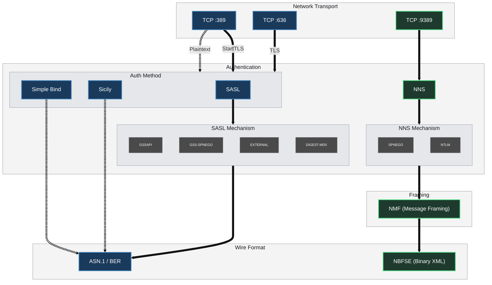
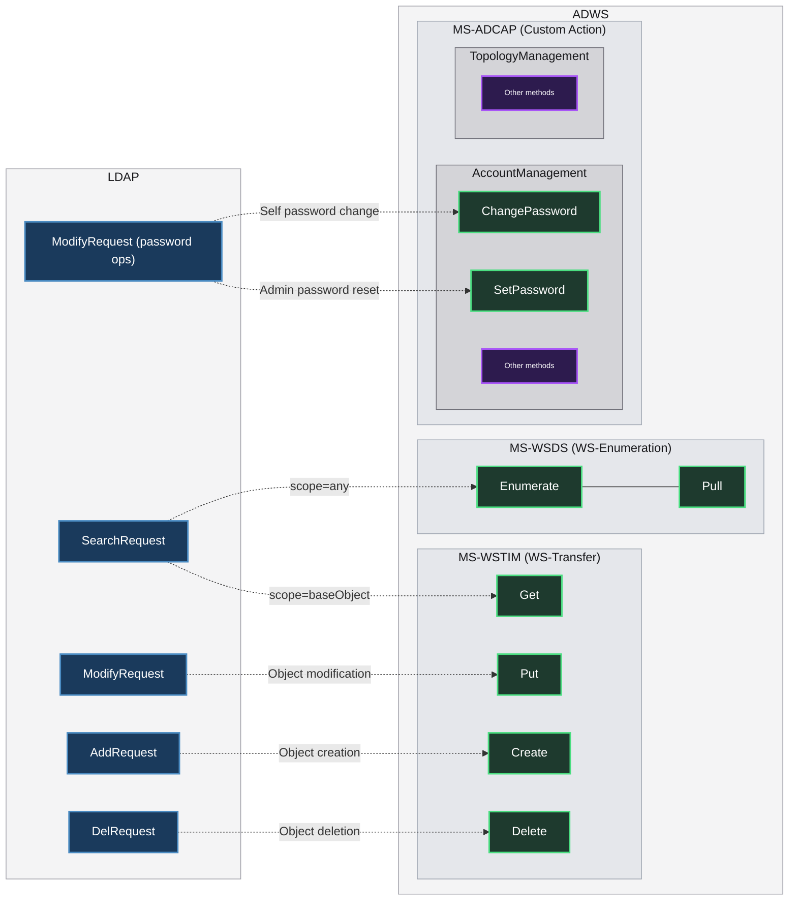
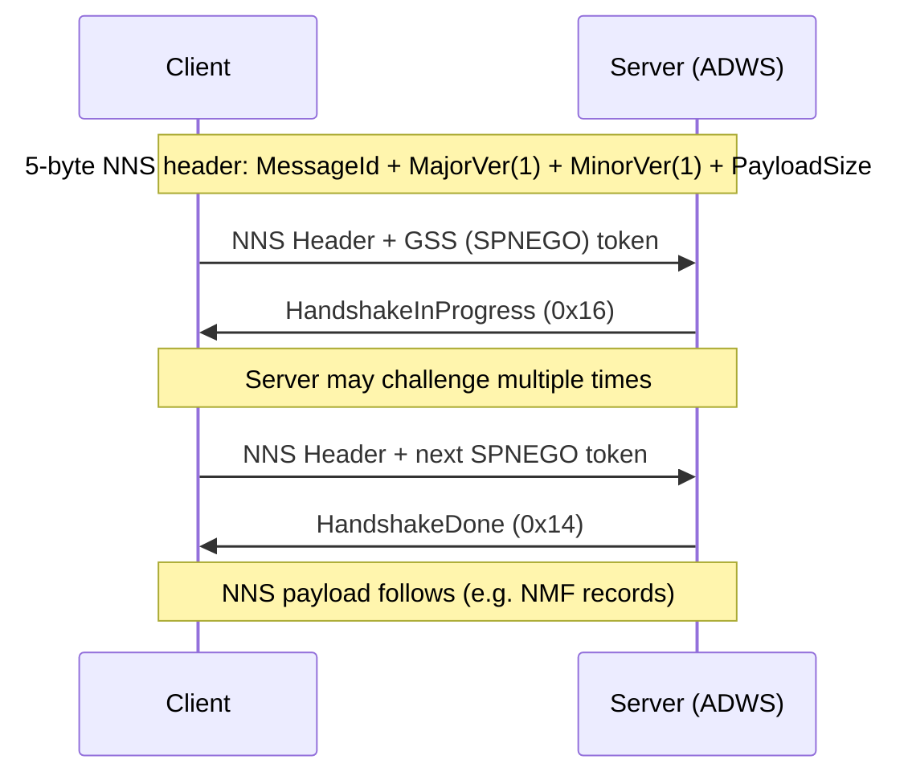
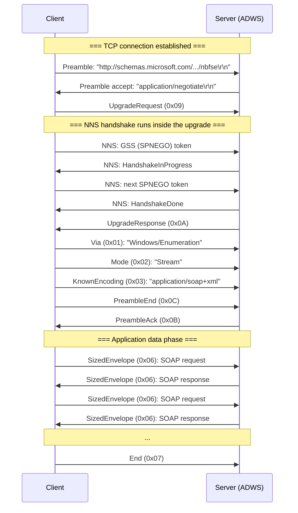

---
layout:
  title:
    visible: true
  description:
    visible: true
  tableOfContents:
    visible: true
  outline:
    visible: false
  pagination:
    visible: true
  metadata:
    visible: true
  tags:
    visible: true
  actions:
    visible: true
---

# 🌉 Active Directory Web Services: The SOAP Bridge

Active Directory Web Services (ADWS) is Microsoft's SOAP-based alternative to the LDAP wire protocol in Windows. It runs on TCP/9389 and uses various protocols to provide the same directory operations through XML/SOAP rather than LDAP's native ASN.1/BER encoding.

The ADWS endpoint is actually split across several Microsoft Open Specifications that work together:

| Specification | Title | Description |
|---------------|-------|-------------|
| [MS-ADDM](https://winprotocoldoc.z19.web.core.windows.net/MS-ADDM/[MS-ADDM].pdf) | AD Data Model and Common Elements | Defines the core data model and base types shared across ADWS operations |
| [MS-WSDS](https://winprotocoldoc.z19.web.core.windows.net/MS-WSDS/[MS-WSDS].pdf) | WS-Enumeration Directory Services Extensions | Defines the WS-Enumeration operations used for AD searches |
| [MS-WSTIM](https://winprotocoldoc.z19.web.core.windows.net/MS-WSTIM/%5bMS-WSTIM%5d.pdf) | WS-Transfer Identity Management Operations for Directory Access | Defines the WS-Transfer operations used for AD object access |
| [MS-ADCAP](https://winprotocoldoc.z19.web.core.windows.net/MS-ADCAP/%5bMS-ADCAP%5d.pdf) | AD Custom Action Protocol | Defines custom actions for account and topology management |
| [MC-NMF](https://winprotocoldoc.z19.web.core.windows.net/MC-NMF/%5bMC-NMF%5d.pdf) | .NET Message Framing Protocol | Defines the record-framing protocol used to delimit messages over the TCP stream |
| [MS-NNS](https://winprotocoldoc.z19.web.core.windows.net/MS-NNS/[MS-NNS].pdf) | .NET NegotiateStream Protocol | Provides SPNEGO-based authentication wrapping Kerberos or NTLM over the transport stream |
| [MS-WSPELD](https://winprotocoldoc.z19.web.core.windows.net/MS-WSPELD/%5bMS-WSPELD%5d.pdf) | WS-Transfer and WS-Enumeration Protocol Extension for LDAP v3 Controls | Defines how LDAP v3 controls are carried inside ADWS SOAP messages |
| [WS-MEX](https://www.w3.org/Submission/WS-MetadataExchange/) | WS-MetadataExchange | The one non-Microsoft spec in the stack - exposes service metadata over an unauthenticated endpoint |

Together they describe how Active Directory domain controllers expose a SOAP endpoint on TCP/9389, with:

* [NNS](https://winprotocoldoc.z19.web.core.windows.net/MS-NNS/[MS-NNS].pdf) and [NMF](https://winprotocoldoc.z19.web.core.windows.net/MC-NMF/%5bMC-NMF%5d.pdf) providing the broad "transport" layer
* [ADDM](https://winprotocoldoc.z19.web.core.windows.net/MS-ADDM/[MS-ADDM].pdf), [WSDS](https://winprotocoldoc.z19.web.core.windows.net/MS-WSDS/[MS-WSDS].pdf), [WSTIM](https://winprotocoldoc.z19.web.core.windows.net/MS-WSTIM/%5bMS-WSTIM%5d.pdf) & [ADCAP](https://winprotocoldoc.z19.web.core.windows.net/MS-ADCAP/%5bMS-ADCAP%5d.pdf) defining the SOAP operations 
* [WSPELD](https://github.com/Macmod/go-adws/blob/main/transport/nbfse_codec.go) specifying how LDAP controls are forwarded through the SOAP layer


According to [Microsoft](https://learn.microsoft.com/en-us/services-hub/unified/health/remediation-steps-ad/configure-the-active-directory-web-services-adws-to-start-automatically-on-all-servers), ADWS is automatically installed since Windows Server 2008 R2 as soon as you install the **AD DS** or **AD LDS** roles to the server.


What this means is that in any modern Active Directory environment today, there should be a fully featured ADWS endpoint running on port 9389 of every DC, alongside the familiar LDAP port 389. The other aspect of it that many find interesting is that the operations performed via ADWS are logged with the loopback address instead of the real source, possibly also evading legacy detection logic. That's why many cybersecurity folks have created tools that use ADWS instead of LDAP to perform queries, such as [powerview.py](https://github.com/aniqfakhrul/powerview.py), [SOAPy](https://github.com/logangoins/SOAPy), [adwsdomaindump](https://github.com/mverschu/adwsdomaindump), [SOAPHound](https://github.com/FalconForceTeam/SOAPHound), etc.

## What can be done with ADWS vs LDAP in AD

First let's consider the full tree of methods exposed by ADWS:

```
ADWS Specifications
│
├─ MS-WSDS (WS-Enumeration Directory Services Extensions)
│   └─ Windows/Enumeration
│       ├─ Enumerate    - Open an enumeration context for an LDAP query
│       ├─ Pull         - Retrieve the next page of results
│       ├─ GetStatus    - Query enumeration context expiry
│       ├─ Renew        - Extend enumeration context lifetime
│       └─ Release      - Close enumeration context, free server resources
│
├─ MS-WSTIM (WS-Transfer Identity Management for Directory Access)
│   ├─ Windows/Resource
│   │   ├─ Get          - Fetch attributes of a single AD object by DN
│   │   ├─ Put          - Modify attributes of an existing AD object
│   │   └─ Delete       - Remove an AD object
│   │
│   └─ Windows/ResourceFactory
│       └─ Create       - Create an AD object
│
├─ MS-ADCAP (Custom Action Protocol)
│   ├─ Windows/AccountManagement
│   │   ├─ ChangePassword                   - Self password change (old+new)
│   │   ├─ SetPassword                      - Admin password reset
│   │   ├─ TranslateName                    - Name format conversion (DN ↔ Canonical)
│   │   ├─ GetADGroupMember                 - Enumerate group members (recursive opt)
│   │   ├─ GetADPrincipalAuthorizationGroup - AuthZ groups + SID history
│   │   └─ GetADPrincipalGroupMembership    - Group memberships of a principal
│   │
│   └─ Windows/TopologyManagement
│       ├─ ChangeOptionalFeature            - Enable/disable AD optional feature
│       ├─ GetADDomain                      - Domain properties (mode, SID, FSMO roles)
│       ├─ GetADDomainController            - DC info (hostname, ports, site, invocationId)
│       ├─ GetADForest                      - Forest properties (mode, domains, GCs, sites)
│       └─ GetVersion                       - ADWS server version
│
└─ WS-MEX (WS-MetadataExchange)
    └─ mex
        └─ Get          - Retrieve service metadata (unauthenticated)
```

Most sources only explore the MS-WSDS **Enumerate+Pull loop**, which can be used as a parallel to a regular **LDAP Search** operation, but as you can see there are **many other actions that can be performed**, including writes. The main problem that implementors need to tackle when designing ADWS integrations is the [NMF](https://winprotocoldoc.z19.web.core.windows.net/MC-NMF/%5bMC-NMF%5d.pdf), [NNS](https://winprotocoldoc.z19.web.core.windows.net/MS-NNS/[MS-NNS].pdf) and [NBFSE](https://winprotocoldoc.z19.web.core.windows.net/MC-NBFSE/%5bMC-NBFSE%5d.pdf) implementations, which are not available in an "authoritative implementation" in languages other than C# - a fact that is very annoying, as tool devs have to reverse engineer these protocols to be able to issue any ADWS messages to a DC. But once that's sorted out, all of these methods can be called remotely without much complication.


The [sopa](https://github.com/Macmod/sopa) tool, for instance, implements a client capable of calling all of these methods using the [go-adws](https://github.com/Macmod/go-adws) library.



In LDAP there aren't many of these "complexities" - it's usually one port, one bind, one encoding, and then the actual LDAP operations to perform. LDAP operations are relatively simple:

```
LDAP Operations
│
├─ Search    - Search the directory for objects matching a filter
│   ├─ baseObject        - DN of the entry to start the search from
│   ├─ scope             - baseObject | oneLevel | subtree
│   ├─ filter            - LDAP filter string (e.g. (objectClass=user))
│   ├─ attributes        - Attributes to return (or empty for all)
│   └─ [other less relevant args]
│
├─ Add       - Create a new entry in the directory
│   ├─ entry             - DN of the new entry
│   └─ attributes        - Initial attribute values for the entry
│
├─ Modify    - Modify attributes of an existing entry
│   ├─ entry             - DN of the entry to modify
│   └─ changes           - Sequence of add / replace / delete operations
│       ├─ add           - Add values to an attribute
│       ├─ replace       - Replace all values of an attribute
│       └─ delete        - Remove specific values or entire attribute
│
├─ Delete    - Remove an entry from the directory
│   └─ entry             - DN of the entry to delete
│
└─ ModifyDN  - Rename or move an entry within the directory
    ├─ entry             - Current DN of the entry
    ├─ newRDN            - New relative distinguished name
    ├─ deleteOldRDN      - Whether to remove the old RDN value
    └─ newSuperior       - New parent DN (empty to keep same parent)
```


Of course there is much more to know about LDAP, but we won't go into details for now. If you want to learn more about LDAP internals in Active Directory, check [MS-ADTS](https://winprotocoldoc.z19.web.core.windows.net/MS-ADTS/%5bMS-ADTS%5d.pdf). For info on the LDAP protocol in general, check [Learn About LDAP](https://ldap.com/learn-about-ldap/).


From the trees above I imagine you can guess the parallels already:

| LDAP Operation | ADWS Equivalent | Notes |
|----------------|-----------------|-------|
| `Search` | MS-WSDS `Enumerate` + `Pull` loop | If `scope=baseObject` (single entry), MS-WSTIM `Get` can be used instead |
| `Add` | MS-WSTIM `Create` | - |
| `Modify` | MS-WSTIM `Put` | Password changes can be performed via manual `Put`s or via MS-ADCAP `ChangePassword` / `SetPassword` |
| `Delete` | MS-WSTIM `Delete` | - |
| `ModifyDN` | - | No ADWS equivalent (unless done in the dirty way via `Delete`/`Create`) |

## Wire format differences

### LDAP: ASN.1/BER on the wire

In the application layer, LDAP natively uses ASN.1 encoded with Basic Encoding Rules (BER). A search request, for example, is a `LDAPMessage` SEQUENCE wrapping a `SearchRequest` - integer constants for scope, deref policy, and size limit, octet strings for the base DN and filter, and a SEQUENCE OF attribute descriptions. Here's a real LDAP search request for `(objectClass=computer)` under `DC=CRETA,DC=LOCAL` (68 bytes on the wire):

```
0000  30 42 02 01 04 63 3d 04  11 44 43 3d 43 52 45 54   0B···c=· ·DC=CRET
0010  41 2c 44 43 3d 4c 4f 43  41 4c 0a 01 02 0a 01 00   A,DC=LOC AL······
0020  02 01 00 02 01 00 01 01  00 a3 17 04 0b 6f 62 6a   ·············obj
0030  65 63 74 43 6c 61 73 73  04 08 63 6f 6d 70 75 74   ectClass ··comput
0040  65 72 30 00                                        er0·
```

Dissected as ASN.1/BER it looks like this:

```
30 42                     -- SEQUENCE (LDAPMessage), length 0x42 = 66 bytes
  02 01 04                -- INTEGER (messageID) = 4
  63 3d                   -- [APPLICATION 3] (SearchRequest), length 0x3d = 61 bytes
    04 11                 --   OCTET STRING (baseObject), length 0x11 = 17 bytes
      44 43 3d 43 52 45 54 41 2c 44 43 3d 4c 4f 43 41 4c
                          --     "DC=CRETA,DC=LOCAL"
    0a 01 02              --   ENUMERATED (scope) = 2 (wholeSubtree)
    0a 01 00              --   ENUMERATED (derefAliases) = 0 (neverDerefAliases)
    02 01 00              --   INTEGER (sizeLimit) = 0 (unlimited)
    02 01 00              --   INTEGER (timeLimit) = 0 (unlimited)
    01 01 00              --   BOOLEAN (typesOnly) = FALSE
    a3 17                 --   [CONTEXT 3] (equalityMatch filter), length 0x17 = 23 bytes
                               With IMPLICIT tagging the inner SEQUENCE
                               wrapper is dropped; the context tag wraps
                               the two OCTET STRINGs directly.
      04 0b               --     OCTET STRING (attribute), length 0x0b = 11 bytes
        6f 62 6a 65 63 74 43 6c 61 73 73
                          --       "objectClass"
      04 08               --     OCTET STRING (assertionValue), length 0x08 = 8 bytes
        63 6f 6d 70 75 74 65 72
                          --       "computer"
    30 00                 --   SEQUENCE OF (attributeSelection), length 0 = empty (return all)
```

### ADWS: Binary XML (NBFSE) on the wire

ADWS sends the same logical operation through SOAP over WS-Enumeration. The same search request is an `Enumerate` SOAP envelope with the filter, baseDN and scope arguments expressed as an `adlq:LdapQuery` in the dialect XML namespace:

```xml
<?xml version="1.0" encoding="utf-8"?>
<s:Envelope xmlns:s="http://www.w3.org/2003/05/soap-envelope" xmlns:wsa="http://www.w3.org/2005/08/addressing" xmlns:addata="http://schemas.microsoft.com/2008/1/ActiveDirectory/Data" xmlns:ad="http://schemas.microsoft.com/2008/1/ActiveDirectory" xmlns:xsd="http://www.w3.org/2001/XMLSchema" xmlns:xsi="http://www.w3.org/2001/XMLSchema-instance">
  <s:Header>
    <wsa:Action s:mustUnderstand="1">http://schemas.xmlsoap.org/ws/2004/09/enumeration/Enumerate</wsa:Action>
    <ad:instance>ldap:389</ad:instance>
    <wsa:MessageID>urn:uuid:46ca5d6c-86a6-4117-9a38-003c63cb29e5</wsa:MessageID>
    <wsa:ReplyTo>
      <wsa:Address>http://www.w3.org/2005/08/addressing/anonymous</wsa:Address>
    </wsa:ReplyTo>
    <wsa:To s:mustUnderstand="1">net.tcp://creta.local:9389/ActiveDirectoryWebServices/Windows/Enumeration</wsa:To>
  </s:Header>
  <s:Body xmlns:wsen="http://schemas.xmlsoap.org/ws/2004/09/enumeration" xmlns:adlq="http://schemas.microsoft.com/2008/1/ActiveDirectory/Dialect/LdapQuery">
    <wsen:Enumerate>
      <wsen:Filter Dialect="http://schemas.microsoft.com/2008/1/ActiveDirectory/Dialect/LdapQuery">
        <adlq:LdapQuery>
          <adlq:Filter>(objectClass=computer)</adlq:Filter>
          <adlq:BaseObject>DC=creta,DC=local</adlq:BaseObject>
          <adlq:Scope>Subtree</adlq:Scope>
        </adlq:LdapQuery>
      </wsen:Filter>
      <ad:Selection Dialect="http://schemas.microsoft.com/2008/1/ActiveDirectory/Dialect/XPath-Level-1">
      </ad:Selection>
    </wsen:Enumerate>
  </s:Body>
</s:Envelope>
```

But this XML isn't sent as plain text - it's encoded with [NBFSE](https://winprotocoldoc.z19.web.core.windows.net/MC-NBFSE/%5bMC-NBFSE%5d.pdf) (`.NET Binary Format: SOAP Extension`), which uses a stateful string dictionary to compress element and attribute names into **short integer tokens**. So what hits the wire is a binary stream of tokens, not text. The dictionary starts with preloaded entries (`Envelope`, `Body`, `Header`, `Action`, `To`, etc.) and is extended with application-specific strings as they appear.

**TODO: An example would work well here**

The [go-adws](https://github.com/Macmod/go-adws) library builds the XML programmatically using the [soap package](https://github.com/Macmod/go-adws/tree/main/soap)'s builder functions (`BuildEnumerateRequest`, `BuildModifyRequest`, etc) and encodes them via the [NBFSE codec](https://github.com/Macmod/go-adws/blob/main/transport/nbfse_codec.go), implemented in the `transport` package.

The practical upshot of NBFSE is that the wire traffic is significantly more compact than plaintext SOAP/XML, but still not as concise as LDAP over BER. A small *search* that fits in a single LDAP page takes one round-trip, whereas over ADWS a search usually needs at least two (`Enumerate` + `Pull`) because opening the query and retrieving results are split across separate operations - the exception being a base-scope read, which can map to a one-shot `Get` from MS-WSTIM. For large result sets, both protocols page - LDAP via the Paged Results control (default page size is 1000 entries in AD), ADWS via repeated `Pull` calls - so the round-trip gap narrows, but ADWS still requires the initial `Enumerate` before the first `Pull`, and the overhead in traffic is significantly larger.

## A Bit of Protocol Internals

The stack below shows the transport, authentication, and encoding layers used by each protocol so we can have a deeper understanding of how they compare in terms of their "preambles" (what we'll call "the broad transport layer" - everything that comes before the "relevant" protocol messages):



**TODO: Improve paragraphs below**

**TODO: Simple example of GSSAPI token/wrapping/unwrapping/signing/sealing?**

This may look like a lot for just the "broad" transport layer, but keep in mind that this is actually just "syntax sugar" architected by protocol nerds for simpler operations:

1) **GSSAPI** is just a standardized way of passing necessary credential material to the server to allow for authentication/signing/encryption using either NTLM or Kerberos (one or the other, with no negotiation involved);
2) **SPNEGO** is a wrapper on top of GSSAPI defining a way for the client to negotiate with the server which GSSAPI algorithm to use;
3) **SASL** is just the protocol-specific wrapper format that the LDAP client uses to specify to the server what it will use for authentication:
* **GSSAPI** (straight without any negotiation, fixing Kerberos as the mechanism*)
* **GSS-SPNEGO** (SPNEGO negotiation to decide between NTLM or Kerberos, then GSSAPI with the chosen mechanism)
* **EXTERNAL** (what is currently known as "Pass The Cert" for LDAP is just passing a valid client certificate during the `ClientHello` of the TLS handshake, then specifying EXTERNAL as the SASL mechanism, basically telling the server - `"hey, I wish to bind using credentials that I specified previously in the TLS handshake, so check it instead of waiting for me to pass additional material!"`.
* **DIGEST-MD5** (legacy, not used anymore). 
4) **Sicily** is an alternative method to authenticate, in Microsoft's LDAP implementation, supports **NTLM only**.


GSSAPI is initially designed to work with either NTLM or Kerberos, but in Microsoft's implementation of the LDAP flow (with SASL) the "**GSSAPI**" mechanism is a wrapper for **Kerberos only**, contrary to the "**GSS-SPNEGO**" mechanism which works with both (and also includes negotiation). NTLM hashes can be used to authenticate when using either **SASL(GSS-SPNEGO)** or **Sicily** negotiation. I know this sort of deviation looks ugly - don't blame me. Sometimes protocol architects do things for backwards compatibility or interoperability reasons that us regular humans can only dream of understanding some day.


On the ADWS side things are more complex in terms of the packet structures, but simpler in terms of the flow possibilities: you can either use NTLM as the mechanism directly, or use SPNEGO to negotiate the algorithm for GSSAPI (which in turn supports NTLM or Kerberos).

As you can see, these mechanisms sometimes mix up the concepts of **authentication** (providing valid credentials and having the server validate them) and **connection security** (integrity and confidentiality, also called **signing** and **sealing**). That's by design, as signing and sealing depend on a shared secret, and if the underlying system already involves credential material, it's wise to use it for both when possible. After all, we may desire signing to prevent a "man in the middle" from messing with our messages, or additionally sealing to avoid them seeing our credential material.

From a tool developer perspective, all of this complexity / flexibility may seem useless and raise a bunch of questions, which are all valid:

* Is it possible to do everything that we would do under LDAPS or LDAP+StartTLS using plain LDAP+SPNEGO instead? (i.e. changing passwords requires a secure connection)
* Do we even need SPNEGO at all if we can just specify GSSAPI and use whatever credentials the user provided (either an NTLM hash or Kerberos ticket)?
* Is it possible to connect using LDAPS and then use GSSAPI (either straight or negotiated via SPNEGO) to also secure (encrypt/sign) the connection twice? (I know this setup **doesn't make sense at all**, but it's still a valid question!)
* Will legitimate servers accept packets that are not signed nor encrypted (sealed) **after** negotiating the usage of GSSAPI?

As much as these questions are interesting to think about (I won't tell you all the answers 🙂), mostly they only teach us one lesson - different tools may authenticate in different ways under the wire, **even when provided the same authentication material**. For me the rule of thumb seems to be to try to play nice: always prefer to use **SPNEGO** instead of plain GSSAPI, and always encrypt and sign properly (either through a TLS channel or using GSSAPI over an unprotected channel). If we already have a secure connection through TLS (the "shared secret" being the trusted certificate authority), it would make little sense to also wrap payloads into an additional cryptographic layer.


**Fun challenge for readers**. Pick a **tool** or **library** that does LDAP auth and study what it does under the wire when given **different sets of credentials** - either through packet capturing or source code inspection.


Back to our use cases - now that we know how to set up the transport and how to authenticate in both LDAP and ADWS, here is a sketch of how to map LDAP operations into their ADWS counterparts:



## The "broad transport layer"

The SPNEGO handshake negotiates the strongest common mechanism between client and server. In NNS the client also declares a **Required Protection Level** - `None`, `Sign` (integrity), or `EncryptAndSign` (integrity + confidentiality) - which is enforced during the GSSAPI exchange: if the level the server negotiates comes back *lower* than what the client required, the client aborts (MS-NNS §3.1.1.3). The bridge always requests `EncryptAndSign` - i.e. sign **and** seal - by passing `transport.ProtectionEncryptAndSign` to the NNS constructor; go-adws also supports `Sign` and `None`, but the bridge doesn't expose a knob to lower it.


"Required" here is a *client-side* minimum, not a server mandate. MS-NNS leaves the protection level entirely to the client, and MS-WSDS only *encourages* (SHOULD, not MUST) using a transport that provides encryption and integrity - no ADWS spec makes sealing a hard requirement. In practice, though, a DC's ADWS endpoint is a WCF `net.tcp` binding configured for Windows message security, so it rejects connections that don't sign+seal. The upshot: always use `EncryptAndSign`, even though it's the server's binding - not the spec - that forces your hand.


### NNS handshake at the byte level

The NNS handshake frame is simple - a 5-byte header (`MessageId` (1 byte), `MajorVersion` (1, `0x01`), `MinorVersion` (1, `0x00`), then a 2-byte **big-endian** `PayloadSize`) followed by the GSS token. (Once authenticated, application data uses a *different* frame: a 4-byte little-endian size prefix in front of the GSS-wrapped payload - no MessageId byte.) The handshake exchanges GSSAPI tokens:

```
Client → Server: HandshakeInProgress (0x16) + GSS token (SPNEGO init)
Server → Client: HandshakeInProgress (0x16) + GSS token (SPNEGO challenge)
Client → Server: HandshakeInProgress (0x16) + GSS token (SPNEGO response)
... repeat until ...
Client → Server: HandshakeDone (0x14)    [or HandshakeInProgress if more rounds]
Server → Client: HandshakeDone (0x14)    [or HandshakeInProgress if more rounds]
// NNS auth complete - this is NMF step 4, triggered by the Upgrade Request (see below);
// the Preamble + Upgrade already went out on the raw socket before this exchange
```

The subtlety is *when* that handshake happens. NMF drives the whole exchange, and the NNS authentication above is actually the **middle** step of it - not something that finishes before framing begins. The full per-endpoint `Connect` sequence is:

```
--- on the raw TCP socket, before authentication (unprotected) ---
1. Preamble records:  Version + Mode (Duplex, 0x02) + Via (endpoint URI) + Encoding (SOAP 1.2 Binary+Dict, 0x08)
2. Upgrade Request (0x09):  protocol string "application/negotiate"
3. Upgrade Response (0x0A)
4. NNS / SPNEGO auth handshake  (the GSS token exchange shown above; per MS-NNS the handshake frames are themselves unprotected)
--- from here on records ride through the authenticated NNS layer (signed + sealed) ---
5. Preamble End (0x0C)  →  Preamble Ack (0x0B)
6. Sized Envelope records (0x06) carry the SOAP messages;  End (0x07) closes the stream
```

So the Preamble and the security Upgrade go out on the bare socket **first**; the `Upgrade Request` (`application/negotiate`) is what triggers the NegotiateStream handshake that turns the plain TCP connection into a signed/sealed one. Only *after* that upgrade do `Preamble End`/`Ack` and the actual SOAP `Sized Envelope` records travel protected. (The unauthenticated `mex` metadata endpoint skips steps 2-4 and sends everything on the raw socket.)

NMF is **record-oriented**: every record is a 1-byte *record type* followed by a type-specific body. The record types the bridge uses (MC-NMF §2.2.1):

| Record | Type byte | Purpose |
|--------|-----------|---------|
| Version | `0x00` | Framing version (1.0) |
| Mode | `0x01` | Connection mode - `Duplex` (`0x02`) for ADWS |
| Via | `0x02` | Target endpoint URI (e.g. `.../Windows/Enumeration`) |
| Known Encoding | `0x03` | Wire encoding - SOAP 1.2 Binary with in-band dictionary (`0x08`) for ADWS |
| Upgrade Request / Response | `0x09` / `0x0A` | Negotiate the security (NegotiateStream) upgrade |
| Preamble End / Preamble Ack | `0x0C` / `0x0B` | Close out the preamble negotiation |
| Sized Envelope | `0x06` | Carries one SOAP message |
| End | `0x07` | Graceful stream close |
| Fault | `0x08` | Framing-level error |

Here are sequence diagrams for both protocol flows described above:

### NNS handshake



### NMF setup



Each **Sized Envelope** record (`0x06`) is the record-type byte, a length prefix, then the NBFSE-encoded payload. The length uses MC-NMF's variable-length integer (7 bits per byte, high bit = "more bytes follow"), so a small message spends only one or two bytes describing its size.

## Lazy Connections

Because the `Via` record pins exactly one endpoint per connection, a single NMF session can only talk to one of `Windows/Enumeration`, `Windows/Resource`, or `Windows/ResourceFactory` - which is precisely why the bridge opens up to three separate NMF sessions (each its own record stream with its own `Via`):

* **Enumeration** (`Windows/Enumeration`) - for MS-WSDS search operations (`Enumerate+Pull`)
* **Resource** (`Windows/Resource`) - for MS-WSTIM `Get`, `Put`, `Delete`
* **ResourceFactory** (`Windows/ResourceFactory`) - for MS-WSTIM `Create`

Each of these requires its own NNS authentication handshake. That means up to three SPNEGO token exchanges per ADWS connection. The credential is reused across all three, but from the protocol's perspective each session is independently authenticated.

The bridge takes advantage of lazy initialization so that `connectADWS()` performs **no network I/O** - it only resolves the FQDN and returns the struct. Each session is dialed on first use via a `sync.Once` guard:

```go
func connectADWS(ctx context.Context, targetHost string) (*adwsConn, error) {
    fqdn, err := adwsResolveFQDN(ctx, targetHost)
    if err != nil {
        return nil, err
    }
    return &adwsConn{
        host: targetHost,
        fqdn: fqdn,
        ctx:  ctx,
    }, nil
}
```

```go
// ensureEnum establishes the Windows/Enumeration session on first use.
func (a *adwsConn) ensureEnum() (*wsenum.WSEnumClient, error) {
    a.enumOnce.Do(func() {
        nns, err := adwsDialNNS(a.ctx, a.host, a.fqdn)
        if err != nil {
            a.enumErr = fmt.Errorf("dial ADWS (enum): %w", err)
            return
        }
        nmf := transport.NewNMFConnection(nns, a.fqdn, adwsPort)
        if err := nmf.Connect(wsenum.EndpointEnumeration); err != nil {
            nns.Close()
            a.enumErr = fmt.Errorf("NMF connect Enumeration: %w", err)
            return
        }
        a.enumNNS = nns
        a.enumClient = wsenum.NewWSEnumClient(nmf, a.fqdn, adwsPort, adwsLDAPPort, a.debugXML, nil)
    })
    return a.enumClient, a.enumErr
}
```

The other two (`ensureXfer` and `ensureFact`) follow the identical pattern. This means a command that only searches never opens the Resource or ResourceFactory sessions, and one that only writes never opens Enumeration - a typical single-purpose command needs **one authenticated session** instead of three.  The three-session setup still means ADWS is inherently more chatty than LDAP when multiple endpoints are needed, but the lazy pattern avoids paying the cost for endpoints the command doesn't use. 

The `adwsConn` struct holds three lazily-initialized WS-* clients, each guarded by a `sync.Once`:

```go
type adwsConn struct {
    host     string
    fqdn     string
    rootDN   string
    ctx      context.Context
    debugXML func(label, payload string)

    enumOnce   sync.Once
    enumErr    error
    enumNNS    *transport.NNSConnection
    enumClient *wsenum.WSEnumClient     // Windows/Enumeration

    xferOnce   sync.Once
    xferErr    error
    xferNNS    *transport.NNSConnection
    xferClient *wstransfer.WSTransferClient // Windows/Resource

    factOnce   sync.Once
    factErr    error
    factNNS    *transport.NNSConnection
    factClient *wstransfer.WSTransferClient // Windows/ResourceFactory
}
```

Each WS-* client wraps an NMF connection (which itself wraps an NNS-authenticated TCP socket). The sessions are **not** initialized in `connectADWS()` - instead each has an `ensureXxx()` accessor that dials and authenticates exactly once via `sync.Once`. Only the sessions actually needed by the command are ever established.

LDAP callers don't see this - they interact with a generic `ldapClient`, which is aliased from `internal/ldapclient.Client`. The `adwsConn` implements the interface by routing each method to the appropriate WS-* client.

### Search: Enumerate + Pull loop

The `Search` method converts an LDAP `SearchRequest` into an enumeration query:

```go
func (a *adwsConn) Search(req *ldap.SearchRequest) (*ldap.SearchResult, error) {
    enum, err := a.ensureEnum() // lazily dial + auth the Windows/Enumeration session
    if err != nil {
        return nil, err
    }
    attrs := req.Attributes
    if len(attrs) == 0 || (len(attrs) == 1 && attrs[0] == "*") {
        attrs = nil // nil => request all attributes (ad:all)
    }
    // req.BaseDN is passed straight through; the command layer already resolved
    // any empty base DN to a naming context via RootDN() before calling Search.
    items, err := wsenum.ExecuteQueryWithControls(
        enum, req.BaseDN, req.Filter, attrs, req.Scope,
        req.SizeLimit, 100, nil, adwsControls(req.Controls),
    )
    if err != nil {
        return nil, fmt.Errorf("ADWS search: %w", err)
    }
    entries := make([]*ldap.Entry, 0, len(items))
    for _, item := range items {
        entries = append(entries, adwsItemToEntry(item))
    }
    return &ldap.SearchResult{Entries: entries}, nil
}
```

`ExecuteQueryWithControls` runs the `Enumerate` → `Pull` loop, paging until the server signals the end - either a `wsen:EndOfSequence` marker or a short page (fewer items than requested), the latter being necessary because ADWS omits `EndOfSequence` for some result sets such as a base-scope rootDSE read (see the rootDSE section below). Any LDAP controls on the request (e.g. an SDFlags control) ride along on every `Pull`.

### Format differences in input & output

When building a bridge between protocols we have to check, of course, if the target protocol (ADWS) always **receives arguments** and **returns responses** in the same formats as the source protocol (LDAP). By reading the specs we can notice a few differences:

#### Replacing `*` in attribute lists for `ad:all`

When a caller requests `"*"` as an attribute, it is [mapped by the library](https://github.com/Macmod/go-adws/blob/main/soap/build_enumeration.go#L48) to a `<ad:SelectionProperty>ad:all</ad:SelectionProperty>` selection property inside the `<ad:Selection>` tag (the ADWS equivalent of the "attributes" field of the Search). Operational attributes (`"+"`) are not supported - MS-WSDS doesn't define an equivalent. According to the MS-WSDS not including an `<ad:Selection>` at all should have the same result, but I used this approach to be semantically correct.

#### Attributes belonging to specific syntaxes use Base64 encoding

ADWS defines that attributes having the syntaxes of **OctetString**, **SidString**, **NTSecurityDescriptor**, or **ReplicaLink** (per MS-ADDM §2.3.4) are always formatted in Base64 and must have the `xsi:type="xsd:base64Binary"` attribute in the XML element to be sent (for writes) or in the returned XML (for reads). Everything else (`Boolean`, `Integer`, `LargeInteger`, DN types, timestamps, etc) is sent/received as `xsi:type="xsd:string"` and handled as usual.

For that purpose, the [go-adws](https://github.com/Macmod/go-adws) library carries a [generated map of attribute names](https://github.com/Macmod/go-adws/blob/main/soap/attr_types.go) (like `objectSid`, `nTSecurityDescriptor`, `objectGUID` etc) to their `xsi:type` - produced from all major published AD schema LDF files by a generator script rather than hand-curated, so it doesn't drift. Unknown attributes default to `xsd:string`.

Whenever performing `Enumerate+Pull` or `Get` operations ("LDAP Search"), the library detects which attributes fall into these four syntaxes and automatically decodes their values from base64 back to raw bytes. 

Whenever we are performing a `Create` ("LDAP Add") or `Put` ("LDAP Modify") operation and we include an LDAP attribute that belongs to these syntaxes, we must **base64-encode the value** and **set `xsi:type="xsd:base64Binary"`** on the `<ad:value>` element in the request - otherwise ADWS will reject it or misinterpret the binary data.

This is performed by calling `soap.EncodeAttrValue()` for each attribute value or `soap.EncodeAttrValues()` for a list of values. If the attribute name maps to `xsd:base64Binary` in the generated map, the raw bytes are base64-encoded and the correct `xsi:type` is set in the generated XML (`<ad:value xsi:type="xsd:base64Binary">`). Everything else is passed through as `xsd:string`.

From the caller's perspective, all of this is invisible: you pass the same strings you would for LDAP, and the bridge handles the encoding.

### Deriving the root BaseDN via rootDSE

**TODO: Goal of this section should be to just mention the purpose of RootDN and GetRootAttribute in the interface definition**

Many `ldap` operations require a BaseDN for searches, be these searches the final goal or an intermediary need, but the user could not always want (or know how) to provide the BaseDN explicitly. The default baseDN for a domain can in most cases looked up from the `rootDSE`, a special entry that we can fetch by performing an LDAP Search with `scope=base` and the empty BaseDN. This works the same in ADWS.

`ldap search` with no `--base-dn` defaults to the domain's `defaultNamingContext`.

The lookup is transport-agnostic. `getRootDSEAttribute` issues a base-scope `(objectClass=*)` search against an empty DN and reads one attribute off the single entry that comes back. Because it takes the shared `ldapSearcher` interface, the identical helper runs over LDAP or over ADWS (where `Search` turns it into an `Enumerate+Pull`):

```go
// getRootDSEAttribute queries one rootDSE attribute (defaultNamingContext,
// configurationNamingContext, schemaNamingContext, ...). Runs over LDAP or ADWS.
func getRootDSEAttribute(conn ldapSearcher, attribute string) (string, error) {
    req := ldap.NewSearchRequest(
        "", ldap.ScopeBaseObject, ldap.NeverDerefAliases,
        0, 0, false,
        "(objectClass=*)", []string{attribute}, nil,
    )
    sr, err := conn.Search(req)
    if err != nil {
        return "", err
    }
    if len(sr.Entries) == 0 {
        return "", fmt.Errorf("root DSE not found")
    }
    return sr.Entries[0].GetAttributeValue(attribute), nil
}

// The ADWS bridge just delegates - no special-casing of the naming contexts.
func (a *adwsConn) RootAttribute(attribute string) (string, error) {
    return getRootDSEAttribute(a, attribute)
}
```

`RootDN()` (the `defaultNamingContext`) is resolved once and cached, following a three-step strategy so a caller can skip the rootDSE round-trip when it wants to:

```go
func (a *adwsConn) RootDN() (string, error) {
    // 1. An explicit --base-dn always wins (even if intentionally empty).
    if a.baseDNExplicit || a.baseDN != "" {
        return a.baseDN, nil
    }
    // 2. --no-rootdse: derive the DN from the auth domain instead of querying.
    if a.noRootDSE {
        domain := domainFromUser(cfg.AuthOptions.User)
        if domain == "" {
            return "", fmt.Errorf("--no-rootdse requires a domain-qualified username (user@domain or domain\\user)")
        }
        return domainToDN(domain), nil
    }
    // 3. Default: query the rootDSE over the wire, then cache it.
    if a.rootDN != "" {
        return a.rootDN, nil
    }
    dn, err := getRootDN(a) // getRootDSEAttribute(a, "defaultNamingContext")
    if err != nil {
        return "", err
    }
    a.rootDN = dn
    return a.rootDN, nil
}
```

Only the `--no-rootdse` path *computes* the DN offline, via `domainToDN()`, which splits the domain on dots and wraps each label in `DC=` (`creta.local` → `DC=creta,DC=local`). It's a handy fallback when you'd rather not pay for the rootDSE read (an extra round-trip, or a server that's touchy about it), but it assumes the domain equals the default naming context - so it won't give you the configuration/schema partitions or any non-default NC. When you actually need those, `RootAttribute("configurationNamingContext")` / `"schemaNamingContext"` read them straight off the rootDSE.


That base-scope, empty-base rootDSE read is precisely the query that surfaced the WS-Enumeration quirk mentioned earlier: ADWS returns the lone rootDSE object *without* a `wsen:EndOfSequence` marker, so the `Pull` loop has to treat a short page (`len(Items) < MaxElements`) as the end. Without that, simply resolving the base DN would spin forever.


## Connecting the dots

The [go-adws](https://github.com/Macmod/go-adws) library started as a low-level implementation of the ADWS protocol stack: the NNS handshake, the NMF record framing, and the SOAP XML builders for all supported operations. The bridge implemented in ginpacket is just a different take on the problem of providing **easy access to ADWS ops** - instead of exposing ADWS as a standalone tool with its own cmdline (such as [sopa](https://github.com/Macmod/sopa)), I introduced a unified `ldapClient` interface that both LDAP and ADWS satisfy, and added a single `--adws` flag to the `ldap` commands to flip between them. Behind the flag, the code calls `connect(useADWS, scheme, startTLS, baseDN, noRootDSE)` which routes either to a standard LDAP dial or to the ADWS connection setup (the extra `baseDN`/`noRootDSE` arguments drive the rootDSE strategy described earlier). This way, if we ever want to implement other subcommands for our `ldap` tool using the "interoperable" subset of LDAP operations, they would instantly be also available over ADWS:

```go
// internal/ldapclient/client.go
type Client interface {
    Search(req *ldap.SearchRequest) (*ldap.SearchResult, error)
    Modify(req *ldap.ModifyRequest) error
    Add(req *ldap.AddRequest) error
    Delete(req *ldap.DelRequest) error
    RootDN() (string, error)
    RootAttribute(attribute string) (string, error)
    Close()
}
```

```go
// cmd/ldap/adws.go
func connect(useADWS bool, scheme string, startTLS bool, baseDN string, noRootDSE bool) (ldapClient, error) {
    targetHost, err := cfg.ResolveTargetHost("")
    if err != nil {
        return nil, err
    }
    ctx := cfg.NewContext()
    if useADWS {
        // ADWS brings its own transport, so the LDAP-only TLS knobs don't apply
        // (plain "ldap" is fine; ldaps / StartTLS are rejected).
        if scheme != "" && scheme != "ldap" {
            return nil, fmt.Errorf("--scheme is not supported with --adws; ADWS always uses its own transport")
        }
        if startTLS {
            return nil, fmt.Errorf("--starttls is not supported with --adws; ADWS always uses its own transport")
        }
        conn, err := connectADWS(ctx, targetHost)
        if err != nil {
            return nil, err
        }
        conn.baseDN, conn.baseDNExplicit, conn.noRootDSE = baseDN, ldapBaseDNExplicit, noRootDSE
        return conn, nil
    }
    conn, err := connectLDAP(ctx, targetHost, scheme, startTLS)
    if err != nil {
        return nil, err
    }
    return &ldapConnClient{conn: conn, baseDN: baseDN, baseDNExplicit: ldapBaseDNExplicit, noRootDSE: noRootDSE}, nil
}
```

The two dialers behave quite differently under the hood:

- **`connectLDAP`** (`cmd/ldap/dial.go`) is a thin wrapper over [`adauth`](https://github.com/RedTeamPentesting/adauth): it resolves credentials for the target, builds `ldapauth.Options` (scheme, StartTLS, and SOCKS-aware Kerberos/LDAP dialers), and calls `ldapauth.ConnectTo`, which dials and binds. One TCP connection, one bind - it returns a ready `*ldap.Conn`.

- **`connectADWS`** (`cmd/ldap/adws.go`) does **no** network I/O. It only resolves the target's FQDN - a reverse-PTR lookup when you passed an IP, since NNS needs a `host/<fqdn>` Kerberos SPN - and returns the `adwsConn` struct. The real dialing is deferred to the `ensureEnum` / `ensureXfer` / `ensureFact` accessors, each of which opens a TCP socket to `:9389`, wraps it in an `NNSConnection` (the constructor is picked by credential type - password, NT hash, ccache, AES key, or PKINIT cert - all pinned to `ProtectionEncryptAndSign`), runs the NNS/SPNEGO handshake, and layers an `NMFConnection` on top bound to that endpoint's `Via`.

So a single LDAP call maps to one connection and one bind, whereas an ADWS command that touches multiple endpoints (say, a search that first resolves the base DN, then a modify) fans out into as many authenticated NMF sessions as endpoints it actually uses - each dialed lazily, so you never pay for the ones you don't touch.

Once any call is made, the caller doesn't know - and doesn't care - whether the bytes flew over LDAP/BER or SOAP/NBFSE. The regular [go-ldap/ldap](https://github.com/go-ldap/ldap) types are used for parameters and responses: the calls receive `*ldap.XxxRequest` and return an optional error. Searches return a constructed `*ldap.Entry` whose fields are filled as to allow calling the same `GetAttributeValue()` and `GetRawAttributeValue()` helpers as we would normally use.

## What you can do with it

As a result of this bridge, all of the `ldap` subcommands below accept the `--adws` flag to use ADWS instead of plain LDAP/LDAPS (it's a shared flag across the whole `ldap` group; a few branches in the tree omit it just to keep the diagram readable).

```
ldap
├── search       --adws   --filter  [--base-dn] [--scope] [--attributes] [--limit]
├── info         --adws   <target>  [--hex]
├── modify       --adws   <target>  --add/--replace/--delete <attr=value>
├── delete       --adws   <DN>
├── enable       --adws   <target>
├── disable      --adws   <target>
├── set-owner    --adws   <target> <new-owner>
├── uac-modify   --adws   <target> <flag> <set|clear>
├── get-gmsa     --adws   <target>
├── get-laps     --adws   <target>
├── dacl         --adws
│   ├── show     <target>  [--filter-*]
│   ├── add      <target> <grantee> <right>
│   ├── remove   <target> <grantee> <right>  [--all]
│   ├── add-dcsync      <domain> <grantee>
│   ├── del-dcsync      <domain> <grantee>  [--all]
│   ├── add-genericall  <target> <grantee>
│   ├── del-genericall  <target> <grantee>  [--all]
│   ├── add-genericwrite <target> <grantee>
│   └── del-genericwrite <target> <grantee>  [--all]
├── create        (parent)
│   ├── user      --name <name>        [--pass] [--parent-dn] [--enabled]
│   ├── computer  --name <name>        [--pass] [--parent-dn]
│   ├── group     --name <name>        [--type] [--parent-dn]
│   ├── ou        --name <name>        [--parent-dn]
│   ├── container --name <name>        [--parent-dn]
│   └── custom    [DN]                 [--template] [--attr]
├── query         --adws
│   ├── users              [--enabled] [--disabled]
│   ├── groups
│   ├── computers
│   ├── containers
│   ├── ous
│   ├── service-accounts
│   ├── gpos
│   ├── spns
│   ├── unconstrained-delegation
│   ├── constrained-delegation
│   ├── asreproast
│   ├── never-expires
│   ├── pwd-not-required
│   ├── cert-templates
│   ├── cert-authorities
│   ├── trusts              [--transitive]
│   ├── passpol
│   ├── mquota
│   ├── key-creds
│   ├── rbcd
│   ├── gmsa
│   ├── laps
│   ├── sccm
│   └── wds
└── keycred
    ├── list      <target>
    ├── add       <target>  [--out-pfx] [--out-cert] [--key-size]
    └── clear     <target>  [--device-id]
```


**ModifyDN** does not exist in ADWS and cannot be replicated precisely - instead one would have to do `Delete` + `Create`, which does not have the same atomicity semantics and may cause problems. The **WhoAmI** operation is also LDAP-specific. 



If you specify `--debug` along with `--adws`, ginpacket will dump **all ADWS SOAPs** from requests and responses into standard error for troubleshooting.


### Example: Reads - Search and Info

The `ldap search` and `ldap info` subcommands are the most straightforward users. With `--adws`, a simple search like:

```bash
./ldap [auth_flags] --adws search '(sAMAccountType=805306368)' cn,distinguishedName
```

...gets translated into a WS-Enumeration `Enumerate` call, followed by one or more `Pull` calls. Each returned `ADWSItem` is converted into a `*ldap.Entry` with `adwsItemToEntry()` - the base64Binary attribute values (octet strings, SIDs, nTSecurityDescriptors, replica link data) get decoded to raw bytes, so `GetRawAttributeValue()` still works.

For single-object fetches, `ldap info` uses `ldap.ScopeBaseObject`, which maps to a WS-Transfer `Get` request on the Resource endpoint - no enumeration needed. **(does it really?)**

### Example: Writes - Modify, Create, Delete

The `ldap modify`, `ldap create`, and `ldap delete` subcommands all accept `--adws`. 

For modifications, all the changes in an LDAP `ModifyRequest` (add/replace/delete) are batched into a **single** WS-Transfer `Put` on the Resource endpoint, expressed as one `<da:ModifyRequest>` with a `<da:Change>` element per change, which the server applies atomically:

```xml
<da:ModifyRequest>
  <da:Change Operation="add">
    <da:AttributeType>addata:description</da:AttributeType>
    <da:AttributeValue>
      <ad:value xsi:type="xsd:string">Updated via ADWS bridge</ad:value>
    </da:AttributeValue>
  </da:Change>
  <da:Change Operation="delete">
    <da:AttributeType>addata:title</da:AttributeType>
  </da:Change>
</da:ModifyRequest>
```

Bare attribute names are auto-qualified as `addata:<name>`, and `xsi:type` is inferred per attribute - `xsd:base64Binary` for the four binary syntaxes, `xsd:string` for everything else (see the encoding section above). A `<da:Change>` with no `<da:AttributeValue>` (as in the `delete` above) removes the whole attribute. Password changes can additionally be routed through MS-ADCAP `ChangePassword` / `SetPassword` instead of a `Put`.

For object creation, ADWS exposes a dedicated `ResourceFactory` endpoint. The typed helpers - `AddUser`, `AddGroup`, `AddOU`, `AddComputer`, `AddContainer` - bundle the required attributes (objectClass, sAMAccountName, etc.) into an IMDA `AddRequest` and send it through WS-Transfer `Create`:

```bash
./ldap [auth_flags] --adws create user 'CN=jdoe,OU=Users,DC=creta,DC=local' jdoe 'SomePass@123' --enabled
```


The code paths for object creation and object modification also handle the `unicodePwd` attribute encoding automatically - for creation, the typed APIs encode it and pass it directly as the `AddRequest` instead of doing the LDAP two-step (create disabled + modify unicodePwd + enable).



For custom creations and modifications, whenever a `unicodePwd` is present without a type hint, we automatically encode it as UTF16LE. For both of these cases, providing a type hint disables the automatic encoding.


Deletion just maps to WS-Transfer `Delete`.

## Conclusions

The ADWS bridge is one of those things that doesn't change the game on its own - you could do everything it does through LDAP - but it's a worthy alternative for evasion purposes or if a DC for whatever reason doesn't have LDAP exposed on the network, the `--adws` flag may be the difference between being able to query and modify the directory and being completely blind.

If you are still not satisfied and want yet another esoteric way of performing changes over LDAP, check out [Helping A Little Too Much: The DFS Replication Helper](https://ginpacket.gitbook.io/docs/articles/helping-a-little-too-much).
