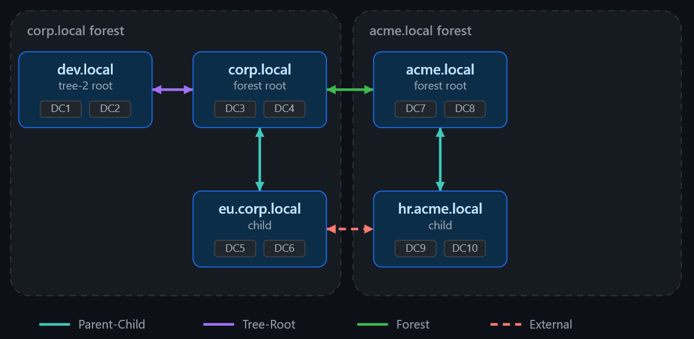
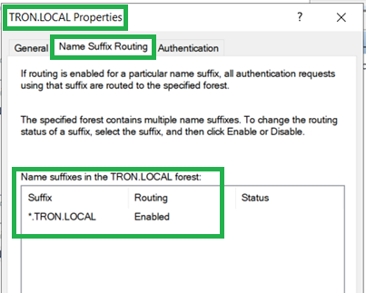
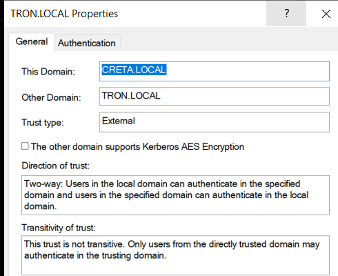
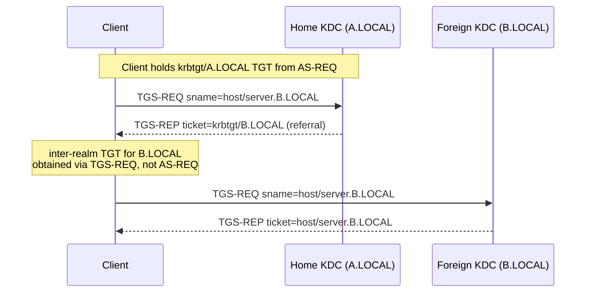
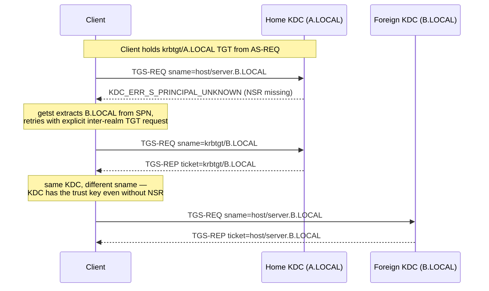
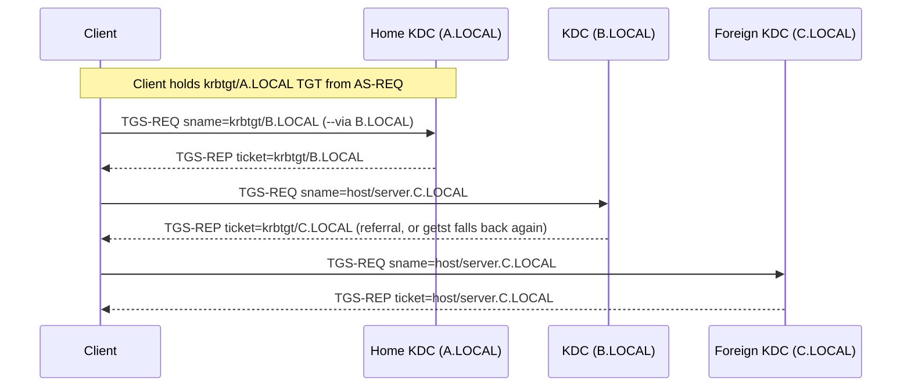

---
layout:
  title:
    visible: true
  description:
    visible: true
  tableOfContents:
    visible: true
  outline:
    visible: false
  pagination:
    visible: true
  metadata:
    visible: true
  tags:
    visible: true
  actions:
    visible: true
---

# 🌉 Cross-realm quirks: the strange case of NSR & referral tickets

Cross-realm trusts in Active Directory come in two flavors:

1. **Forest trusts** These can only exist between two forest-root domains, and are always **forest-transitive** - if forest root domain A trusts forest root domain B, A trusts all domains in forest B, but A does **not** trust any domains outside of B automatically.
2. **External trusts**: These are relationships between an arbitrary domain from forest A and another arbitrary domain from forest B, and are always **non-transitive** - if an external trust exists from A to B and B trusts C, A does not trust C by transitivity.

For all cross-realm trusts, the trust can be either one-way or two-way, as forests are the security boundary in AD. For intra-realm trust types, such as parent-child or tree-root trusts, the trust is always **transitive and bidirectional**.

<figure><figcaption></figcaption></figure>

Regardless of that, all sources that talk about requesting a cross-realm service ticket always document it as a two-step process: first obtain a referral TGT (an inter-realm TGT encrypted with the trust key), then present it to the remote KDC to get the final service ticket.

The main issue here that some don't seem to be aware is that, to proceed with the flow, you (as the tool) often need to first receive a "referral" pointing to the target domain. But the feature that actually controls whether the DC returns a referral or not for TGS-REQ requests is called `Name suffix routing` (NSR), a list that exists in the properties of each **forest trust** and specifies which name suffixes (domains) are to be "routed" through that forest trust. This list gets populated when you set up the forest trust:

<figure><figcaption></figcaption></figure>

If your name suffix routing list was broken from the start (i.e. if your DNS is broken when you set up the trust), or if an admin manually removes an entry afterwards, upon receiving TGS-REQ requests a DC will **not issue** referrals pointing to the foreign DC and will raise an error instead. This has annoyed me a couple times in my lab, as I had lots of trouble simulating referrals when using external trusts: **external trusts simply do NOT add entries to the NSR list** upon creation - the `Name Suffix Routing` tab does not even exist in the trust properties panel in the standard Windows UI for external trust properties:

<figure><figcaption></figcaption></figure>

In other cases, I've also seen companies remove NSR entries in what was presumably an effort to **break the trust in one way** instead of actually changing trust attributes.

The "good" news is that this **actually breaks cross-realm Kerberos authentication** for most tools out there. The **bad** news is that this is actually not a security boundary - it's just that tools **give up** whenever they send the first TGS-REQ to the home KDC and the TGS-REP comes back **with an error/without a referral**.

But the referral is not the only way to cross a realm boundary. When a KDC doesn't issue a referral, it often returns `KDC_ERR_S_PRINCIPAL_UNKNOWN` instead - that's a meaningful signal, not a dead end. If you know the target realm (because you extracted it from the SPN, or because you know the trust topology), you can bypass the missing routing entry entirely by explicitly requesting the inter-realm TGT (`krbtgt/<FOREIGN-REALM>`) from the home KDC - the same TGT the KDC would have returned automatically as a referral - then presenting it to the foreign KDC to get the service ticket. In `getst` this is handled automatically for the common single-hop case: when it receives `KDC_ERR_S_PRINCIPAL_UNKNOWN` on the first hop and can infer the foreign realm from the SPN, it falls back to an explicit inter-realm TGT request and continues the referral chain from there.

For more complex topologies - multi-hop trust chains including external trusts and/or forest trusts with missing NSR entries - the automatic fallback may not enough, because the tool would need to know which intermediate realm to ask for first, and that information isn't in the SPN. For these cases `getst` accepts a `--via` flag (repeatable, ordered) that lets you specify the intermediate realms explicitly:

```
getst --via B.LOCAL -s host/server.C.LOCAL
```

This requests the inter-realm ticket `krbtgt/B.LOCAL` from the home KDC first, then presents that ticket to B's KDC to continue the chain, bypassing any missing NSR entries along the way. Each `--via` hop is requested unconditionally regardless of what the KDC would have returned on its own, so it works even when automatic referrals are completely broken at every intermediate step.


One important nuance: an inter-realm TGT is still obtained via a **TGS-REQ**, not an AS-REQ. The AS-REQ/AS-REP path only ever produces a TGT for your own home realm. Every ticket you get after that - whether it's a service ticket or a `krbtgt/<FOREIGN>` inter-realm TGT - comes from a TGS-REQ authenticated with whatever TGT you hold at that point. What makes a ticket a "TGT" is its `sname` (`krbtgt/<REALM>`), not how it was obtained.


The three flows `getst` handles are illustrated below.

**Case 1: Normal referral (NSR intact, forest trust)**

The home KDC's NSR list has an entry for the foreign realm, so it automatically returns a referral when you ask for the service ticket.



**Case 2: Automatic fallback (broken/missing NSR, single hop)**

The home KDC returns `KDC_ERR_S_PRINCIPAL_UNKNOWN` instead of a referral. `getst` detects this, extracts the foreign realm from the SPN, and retries with an explicit `krbtgt/B.LOCAL` request to the same KDC.



**Case 3: Explicit `--via` chain (multi-hop, external trusts, broken NSR at every step)**

`getst --via B.LOCAL -s host/server.C.LOCAL` - intermediate realms are specified manually. Each hop unconditionally requests `krbtgt/<NEXT>` regardless of what the KDC would have returned on its own.


