---
layout:
  title:
    visible: true
  description:
    visible: true
  tableOfContents:
    visible: true
  outline:
    visible: false
  pagination:
    visible: true
  metadata:
    visible: true
  tags:
    visible: true
  actions:
    visible: true
---

# 🔁 Helping a Little Too Much: The DFS Replication Helper

For reasons that are unknown to me, one day I decided to read through the [MS-DFSRH](https://winprotocoldoc.z19.web.core.windows.net/MS-DFSRH/%5bMS-DFSRH%5d.pdf) (DFS Replication Helper) spec. I think I was looking for more methods related to DFS as I thought at the time that [MS-DFSNM](https://winprotocoldoc.z19.web.core.windows.net/MS-DFSNM/[MS-DFSNM].pdf) (DFS Namespace Management protocol) didn't have all methods that were relevant for DFS management ("where were the methods to deal with the replication part of DFS?" was likely what I had in mind). I did not get an answer to that question, but one thing stood out immediately - the DFSRH protocol includes DCOM interfaces called `IADProxy` / `IADProxy2` and basically states that these can be used by any local admin to perform write-only LDAP operations (Create, Modify, Delete):

<figure>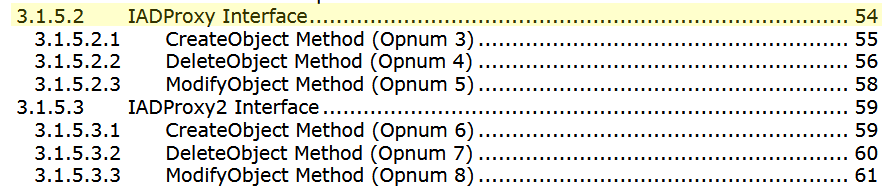<figcaption></figcaption></figure>

<figure>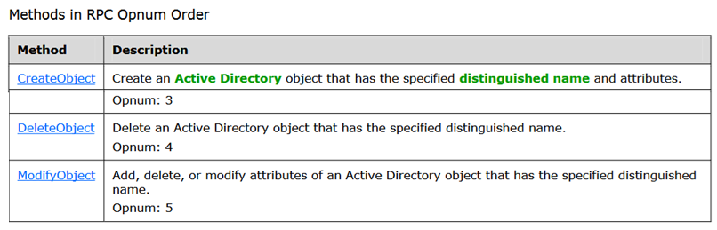<figcaption></figcaption></figure>

I had no idea (and still don't) why DFS needs this sort of thing - maybe to look up important information about AD-integrated DFS namespaces or something like that. All it takes for these interfaces to exist is the **DFS Replication** feature installed on the host.

Let's look at the `Create` call, as `Modify` and `Delete` aren't much different:

<figure>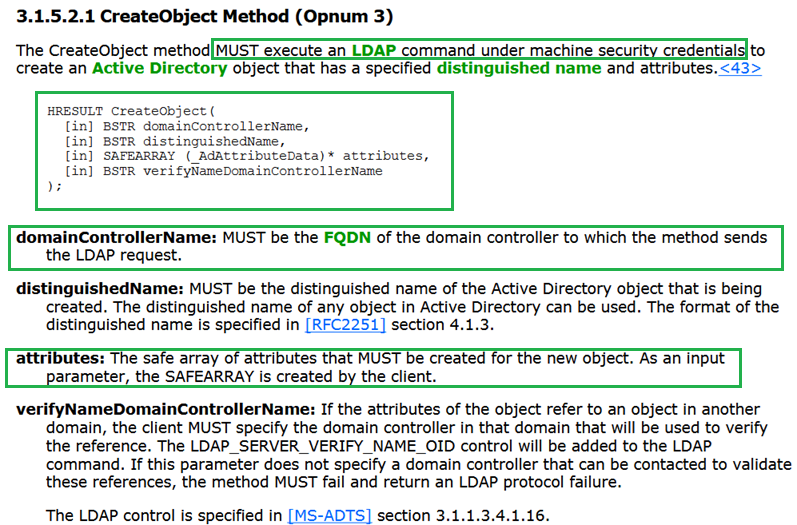<figcaption></figcaption></figure>

Two things are interesting here: the first is that the actions are performed with the target's computer account. This is often a "feature", as many organizations still grant sensitive Allow ACEs (Full Control, Generic Write, etc) on critical objects to the `Domain Computers` group or to specific computer objects.

The second is that you can specify the domain controller to receive the operation in the call arguments. Can it be any address, I wondered? The answer is yes: you could even run `Responder` on a VPS, issue one of these calls to a target, and capture NetNTLM hashes for the target's computer account from the LDAP bind, or maybe run ntlmrelayx on a pivot host and relay the credentials into the real DC for a full LDAP shell (confirmed below):

<figure>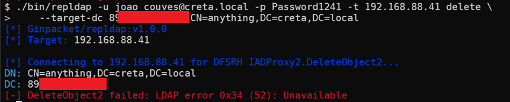<figcaption></figcaption></figure>

<figure>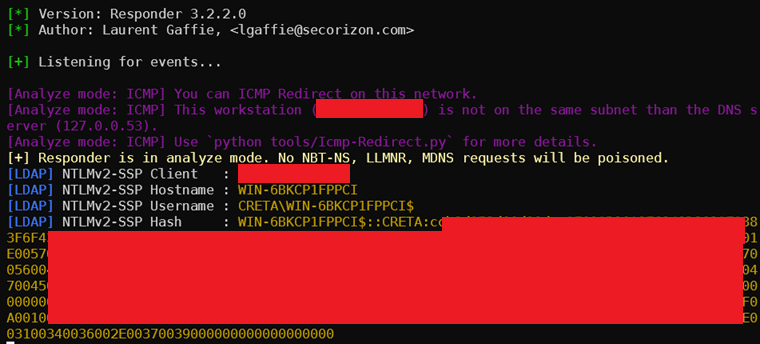<figcaption></figcaption></figure>

If the DC itself has the **DFS Replication** feature, you can also ask it to **connect to itself**, but then the security context would be tied to the `NETWORK SERVICE` user instead of the computer account, changing the scope of actions that can actually be performed. Whenever the DC passed in the call is different from the host receiving it, the call must go through the network, so the `TARGET$` computer account is used instead of the `NETWORK SERVICE` principal. This is standard behavior of virtual accounts such as `NETWORK SERVICE`, as described in [Becoming the Machine, A Virtual Account's Guide To Total Control](https://www.abdulmhsblog.com/posts/iammachine/) by Abdul Mhanni.

What this means is that:

1. If you have admin privileges on a host with DFS Replication, you can take control of its computer account with these calls instead of other well known coercion methods;
2. Instead of capturing NetNTLM or relaying it, you could just use the `Create` / `Modify` / `Delete` calls directly to tell DFSRHelper to perform the action for you;
3. If there are two DCs and one has DFS Replication, you could ask it to perform actions on the other DC's LDAP using its own computer account;
4. If there is only one DC, you could ask it to perform actions on behalf of `NETWORK SERVICE` if any object allows this principal explicitly in its own DACL.

## Shadow Credentials

One relevant example of what can be accomplished here is using [repldap](https://ginpacket.gitbook.io/docs/tools/repldap) to manage the `msDS-KeyCredentialLink` value on the target computer object pointing to a keypair you control (aka "shadow credentials"), giving you the ability to use the matching private key to request a TGT as that computer account via PKINIT, effectively giving persistent Kerberos access to the account without touching LSASS or modifying passwords:

**TODO**: Get definitive example with two DCs or with a member server+a DC

```bash
./repldap [auth_flags] --target-dc WIN-6BKCP1FPPCI keycred add 'CN=WIN-6BKCP1FPPCI,OU=Domain Controllers,DC=creta,DC=local'
```

<figure>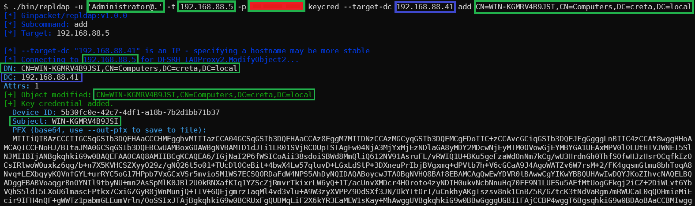<figcaption></figcaption></figure>

What makes the DFSRHelper path interesting here is that the write goes through the target's own machine account, so if the machine account has write access to its own msDS-KeyCredentialLink (which is the default), you can do this with a single `repldap modify` call (as long as the target is different from the supplied DC).

## Changing Passwords

### Admin Resets

Both the `changepwd dfsrh` or `repldap modify` subcommands can be used to issue admin password resets via this primitive to computer or user accounts - they are just regular `Modify(Replace)` operations on the corresponding `unicodePwd` attribute. Of course, as usual, the principal that will perform the action (either `NETWORK SERVICE` when `target==targetDC` or `TARGET$` otherwise) has to have the necessary rights on the object whose password is going to be reset:

```bash
$ ./changepwd dfsrh [auth_flags] \
  -a DN_FOR_TARGETOBJECT -w NewPass@123 \
  --target-dc DCHOSTNAME

# Alternative
$ ./repldap [auth_flags] modify DN_FOR_TARGETOBJECT --replace unicodePwd=Banana@1338 --target-dc DCHOSTNAME
```

<figure>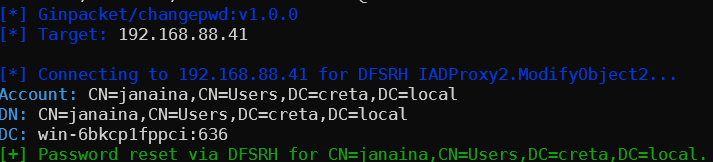<figcaption></figcaption></figure>


Since password operations in LDAP can only be performed via LDAPS on 636, you must always use the proper DC hostname instead of its IP in `--target-dc` to avoid certificate validation issues between the `target` and the `targetDC`.


### Self password changes

**TODO**: Finish this

### Other write actions

Although a bit more niche, it's also possible that a server's computer account (or `NETWORK SERVICE`) has rights to create objects in OUs, containers, or even the root of the domain. In that case, the [repldap](https://ginpacket.gitbook.io/docs/tools/repldap) tool can also be used to **create** or **modify** users / computers / containers / OUs, or any other kind of AD object by using `repldap create` and `repldap modify`.

One thing to note, though, is that the `_AdAttributeData` structure, used to pass the value of each attribute to be either created or changed to the ADProxy `Create` and `Modify` methods, carries exactly **one value field** (not a **list of values** as is the usual LDAP interface for creations and modifications):

<figure>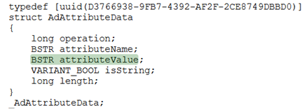<figcaption></figcaption></figure>

On top of that, the `DfsrHelper.dll` only forwards that value field through the LDAP operation for `Modify(add)` and `Modify(replace)` calls, but **not for `Modify(delete)`**. The practical consequences are:

1. For **attribute modifications** (`repldap modify`): **replacements** (`--replace`) clear all existing values of the attribute and set the single supplied value - there is no way to replace a multi-valued attribute with multiple new values in one call;
2. Also for **attribute modifications** (`repldap modify`): **deletes** (`--delete`) always remove all values of the attribute regardless of what value is supplied - value-specific deletes are not supported.
3. Finally, for **object creation** (`repldap create`), **multi-valued attributes cannot be set** - passing the same attribute name twice issues two separate LDAP Add operations on the same attribute (**non-atomically**), which AD may reject sometimes. The typed `repldap create [XXX]` subcommands already handle these constraints. For **custom creations** (`repldap create custom`) more testing is needed to verify the scope of this limitation.

## Internals

To analyze the code responsible for this behavior, the first step is to look for information on the DCOM **interfaces** involved (`IADProxy` / `IADProxy2`). In this case, the spec itself, in footnote `<15>`, spoils that the DCOM class responsible for these interfaces is defined in `DFSRHelper.dll`, which lives in `C:\Windows\System32`. But even if it wasn't mentioned, we could trace the interfaces defined in the spec - in sections 3.1.5.2 and 3.1.5.3 it declares the IIDs of these interfaces as `{4BB8AB1D-9EF9-4100-8EB6-DD4B4E418B72}` and `{C4B0C7D9-ABE0-4733-A1E1-9FDEDF260C7A}`. If we look up the interfaces with i.e. [OleViewDotNet](https://github.com/tyranid/oleviewdotnet) and open up their properties, we can see their type libraries point to the same DLL:

<figure>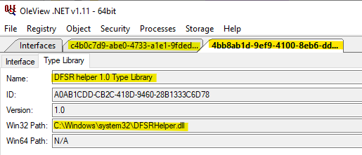<figcaption></figcaption></figure>

We could also somehow find the CLSID of the **DFSRHelper** class by name and then find the DLL at `HKEY_CLASSES_ROOT\CLSID\{CEFE3B33-B60F-44fc-BFE4-D354A1CE39EE}\InprocServer32`.


Mapping between CLSIDs and interfaces they implement can be annoying - it's possible to enumerate interfaces via `HKCR\Interfaces` and classes via `HKCR\CLSID`, but the link between them is not trivial to find without analyzing type libraries, using a pre-computed mapping or probing all interfaces on all classes via `IUnknown:QueryInterface`.


Opening this DLL in Ghidra for analysis we can quickly see that it imports the relevant functions for `Add`, `Modify` and `Delete` operations from `wldap32.dll`:

<figure>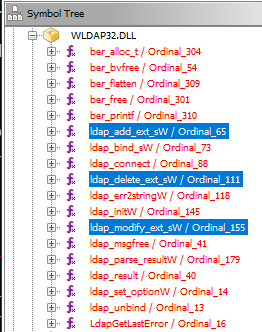<figcaption></figcaption></figure>

We arrive at our destination by checking the references to each of these functions with `Ctrl+Shift+F`, then going to the first result and decompiling with `Ctrl+E`. For **ldap_modify_ext_sW**, for instance, we find that the `CADProxy::AddModifyImpl` function is actually responsible for forwarding both Add and Modify:

<figure>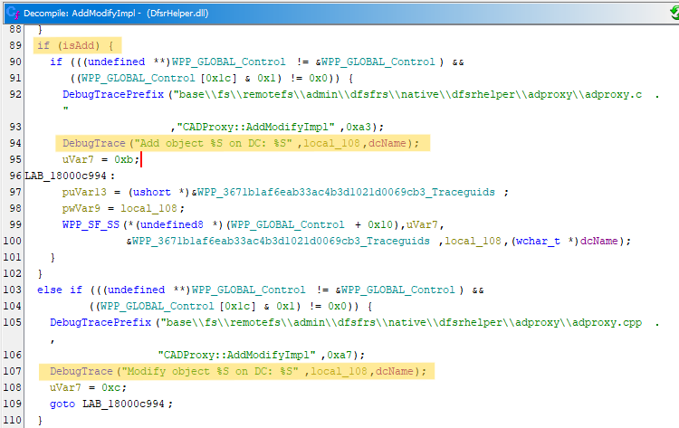<figcaption></figcaption></figure>

<figure><figcaption></figcaption></figure>

After renaming some variables and defining a few types to what the structures should look like (although not perfectly as the decompiler is often not very friendly), we can see that there is a loop that iterates on the SafeArray passed to the original call (the `attributes` parameter), extracts each element of it (an `_AdAttributeData`), and starts filling up `modToForward` with the values for the definitive operation to forward to the LDAP calls:

<figure>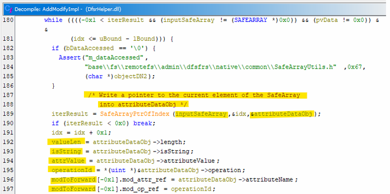<figcaption></figcaption></figure>

But then right below that line it branches on `operationId != 0x1`, where 0x1 is the constant for `LDAP_MOD_DELETE`, **not filling** the values array at all for **Modify(delete)** operations - that's why we cannot delete attribute values selectively using this primitive, as mentioned in the previous section:

<figure>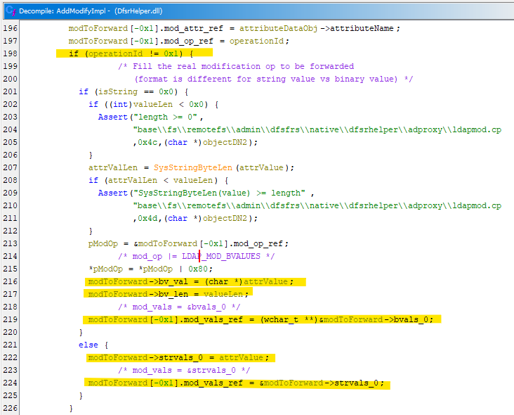<figcaption></figcaption></figure>

## Conclusions

This primitive doesn't seem to cross any security boundaries, as admin privileges are required from the start and with privileges there are other ways of taking over the machine account, but it's definitely an esoteric approach to the problem 🙂
