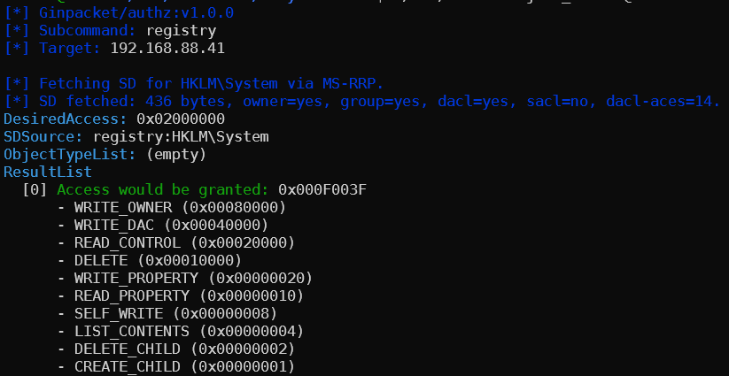
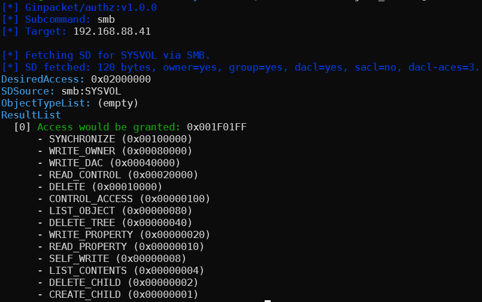
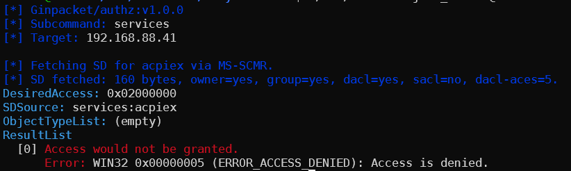

---
layout:
  title:
    visible: true
  description:
    visible: true
  tableOfContents:
    visible: true
  outline:
    visible: false
  pagination:
    visible: true
  metadata:
    visible: true
  tags:
    visible: true
  actions:
    visible: true
---

# 🧾 Leveraging MS-RAA as a Remote Authorization Oracle

The Windows authorization model has a neat property that's easy to overlook: the kernel's AuthzAccessCheck routine is entirely self-contained - given a **security descriptor** and a **token** (a SID plus a set of **group SIDs**, **restricted SIDs**, **user claims**, and **device claims**), it deterministically answers whether access **would be granted** - no actual object access involved. Microsoft exposed this as a remotely callable protocol: [MS-RAA](https://winprotocoldoc.z19.web.core.windows.net/MS-RAA/%5bMS-RAA%5d.pdf) (the **Remote Authorization API**).

The [authz](https://ginpacket.gitbook.io/docs/tools/authz) tool provides access to the two most useful calls of this protocol:

## AuthzrGetInformationFromContext

The `info` subcommand uses the `AuthzrGetInformationFromContext` call to create a transient authorization context from any SID and return what the remote machine thinks that principal's token looks like - their groups, restricted SIDs, user claims, and device claims. This is a clean way to inspect how a user would be seen by the authorization engine on a given host, without having to pull apart a PAC, issue a Kerberos ticket or perform LDAP queries (which would only tell us part of the story). It also reveals claims that would be populated from Active Directory's claims transformation pipeline:

**TODO: Example**

## AuthzrAccessCheck

The `check` subcommand takes it further: given a **SID** and a **security descriptor** (hex or inline SDDL), it asks the remote machine whether that principal would be granted the requested access mask using `AuthzrAccessCheck`. Additionally, you can provide a **specific target objects** to `authz`, and the tool will automatically fetch its SD for you using the corresponding protocol, and then feed it to MS-RAA for the check itself. This works with any securable object as long as there is (1) a remoote way to fetch its descriptor, (2) the caller user has appropriate permissions to obtain it, and (3) the caller has appropriate permissions to call `AuthzrAccessCheck`. In `authz` the following securable objects are supported by default:

* Registry keys
* SMB shares
* LDAP objects
* Scheduled task
* Services
* WMI namespaces

<figure><figcaption>Checking access to a registry key</figcaption></figure>

<figure><figcaption>Checking access to an SMB share</figcaption></figure>

<figure><figcaption>Checking access to a service</figcaption></figure>

You can also inject extra group SIDs (--add-groups), user claims, or even build a compound context (the mechanism Windows uses to evaluate Kerberos FAST and dynamic access control policies) with device SID and device claims.

You may wonder why this is more useful than just **parsing the security descriptor yourself** and running the **DACL evaluation** locally - and that's a fair question, because for simple DACLs with regular ACEs it would seem like a simple task. But there are several cases where local simulation breaks down:

1. **Group membership**: to evaluate a DACL correctly you need the full transitive group membership of the principal on that specific machine, which includes local groups, domain groups, the special identity SIDs (Authenticated Users, Interactive, Network, etc.), and any SID history entries - none of which are directly recoverable from a single LDAP query.
2. **Object type list**: Active Directory uses a hierarchical object type list (object => property set => property) to evaluate property-level access rights like `ReadProperty` and `WriteProperty` on individual schema attributes, and the way generic rights map to specific rights for a given object class is defined by the schema, not the ACE.
3. **Privileges**: Windows privileges (`SeBackupPrivilege`, `SeRestorePrivilege`, `SeTakeOwnershipPrivilege`, etc.) are checked after DACL evaluation for certain operations and can override a DACL deny - `SeBackupPrivilege` lets you read any file regardless of its DACL, for instance. Privilege assignment is local policy (LSA/GPO) and is not stored in AD at all, so local simulation has no way to know which privileges a principal holds on a specific machine. `AuthzrInitializeContextFromSID` accepts an `AUTHZ_COMPUTE_PRIVILEGES` flag (`--privileges` in the tool) that tells the server to populate the privilege set in the context before the access check runs.
4. **Claims**: Dynamic Access Control evaluates Central Access Policies, which are stored on the DC but applied by the authorization engine on the target machine after claims transformation - a pipeline that can filter, rename, or add claims in ways that are defined in AD but executed locally.
5. **Conditional ACEs**: A normal ACE says "if SID X, grant/deny Y". A conditional ACE says "if SID X _and_ this boolean expression evaluates to true, grant/deny Y". The expression is bytecode stored inline in the ACE's ApplicationData and can test user claims (such as `@User.Department == "Finance"`), device claims (`@Device.Managed == true`), or resource attributes (`@Resource.Sensitivity < 3`) using comparison, containment, and group-membership operators. They are the on-disk mechanism behind DAC's Central Access Policies: when an admin pushes a CAP via GPO, Windows stamps each targeted file's SACL with a `SP` (scoped policy ID) ACE pointing to the policy, and the policy's rules are evaluated as conditional ACEs at access time.

Asking the remote machine's own authorization engine via MS-RAA means all of this is handled for you - you get the same answer the machine would give to a real access attempt. The result is a precise answer: if this token walked up to this object on this machine, would it be allowed in? No guessing, no parsing ACEs and no complex logic to implement.
