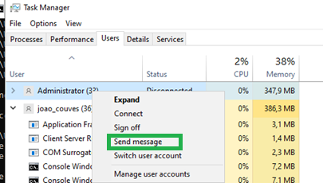
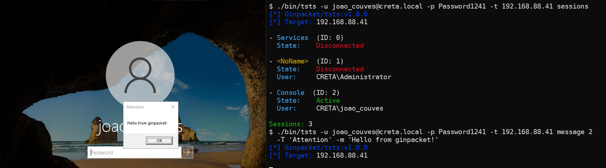
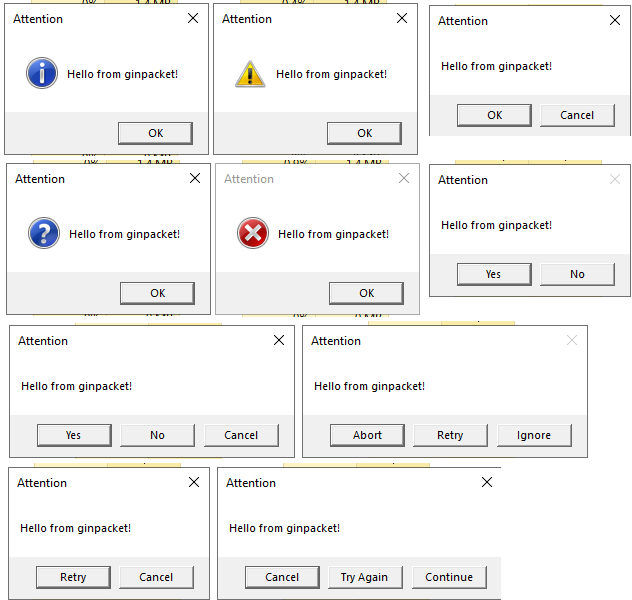
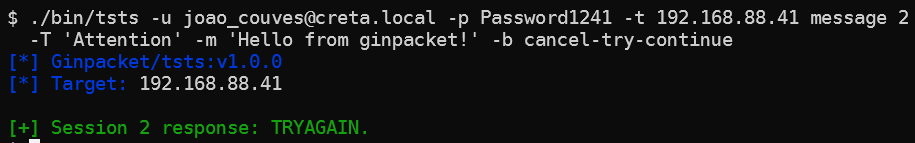

# When RDP Talks Back: Hello From The Terminal Server

Remember the `Users` tab in task manager, where you could select a session and click on this button?

  

As it turns out, MS-TSTS includes method called `ShowMessageBox` that does just that. With admin privileges, you can just send a message to any session in any Windows host you can reach. I have not seen anyone talk about this sort of thing before, but it could be a fun way of demonstrating impact or coercing the user. Imagine you're one day working at a company, troubleshooting a server, and suddenly a message pops up asking you to do something, or to not do something you would usually do. The call even works on console and locked sessions, as the alert pops up in the lock screen:

  

Since the icon and title are free to change, it could be used to trick the user into arbitrary actions. You can also change the set of buttons that appear in the message:

  

You can tell from the response code **what button the user clicked** - one could even communicate with the user remotely and have him answer questions using this sort of call.

  

Or you can just use the `--async` flag to ignore the result and issue hundreds of messages to the user. They will get queued up on his screen and he'll have to manually close each one.

By the way, this is the core of the native "msg.exe" Windows tool - the native command is less customizable, and with `tsts` we can now emulate it from any host in the network. Way back, there used to be a `net send` command that used an unauthenticated API (the `Messenger Service`). As you can imagine, both this protocol and its associated command got deprecated and removed by Microsoft due to widespread abuse.
